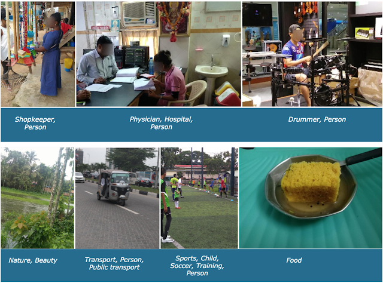

# CS 539: Machine Learning - Final Team Project

## Development of Robust Image Classifiers for Geo-diverse Distributions

### The Team
- Alexander Shoop (akshoop@wpi.edu, @akshoop)
- Claire Danaher (cedanaher@wpi.edu, @claireedanaher)
- Clayton Dembski (cjdembski@wpi.edu, @cabincabin)
- Saina Rezvani (srezvani@wpi.edu, @SainaRez)

### Introduction
The effectiveness of modern machine learning image classifiers is heavily dependent on the degree to which the corpus is representative of the images being classified. When corpuses are not inclusive, models produce high rates of misclassification of images with low representation. This team project focused on the development of robust image classification machine learning models to handle pictures from geographically diverse regions (primarily non-Americas and non-European). The inspiration for this project came from a Kaggle competition called the [Inclusive Images Challenge]( https://www.kaggle.com/c/inclusive-images-challenge). This is where information on the training and test image datasets can be found as well.

The team developed a traditional Convolutional Neural Network (CNN) using Tensorflow and Keras. We also had to learn and utilize the Google Cloud Platform (GCP) services; the GCP services used were Cloud Storage and Model Training due to the enormous size of the Open Images dataset. The team hypothesized that emphasizing the structure (aka. features such as edges) would allow for better generalization. The results of this project work suggest that a method that augments the dataset to support generalization is likely a better approach.

### Related Work

### Methodology

### Results

### Conclusion
